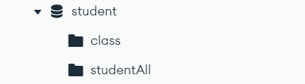

**グループ名　ナットウ**
## **メンバー**
西垣 翼 : リーダー, プログラマー <br>
中村 康祐 : サブリーダー, プログラマー, 動画作成 <br>
小倉 竜雅 : 書記, テスター <br>
山田 絃暉 : 発表者, 資料作成 <br>
曳原 楓琳 : デザイン, 資料作成  <br>
糟谷 瑛希 : テスター <br>
## **1. プロジェクト名**

- 学生証バーコードを利用したWeb出席管理アプリ
- アプリ名  Learn on Time
## **2. プロジェクト概要**

- 学生の出席を効率的に管理するために、学籍番号と学生証のバーコードを使用したWebアプリを開発します。
- 学生はアプリで学籍番号または学生証のバーコードをスキャンすることで、出席が記録されます。
- 記録はリアルタイムでGoogle Sheetsに反映され、教員は出席情報を簡単に管理できます。
## **3. 目的・背景**

- 従来の出席確認手法では手間がかかり、記録ミスや時間のロスが発生していました。本アプリにより、より正確で効率的な出席管理を実現し、教員の業務負担を軽減することが目的です。また、学生証をスキャンすることで学生証の着用率の向上も目指しています。
## **4. 対象ユーザー**

- 大学または専門学校の教員および学生
- 学生証にバーコードが印刷されている学校
## **5. 機能要件**
  **学生機能**
	- 学籍番号の手動入力
	- 学生証バーコードのスキャン（QuaggaJSの使用）
	- スキャン結果の送信
**管理者機能（教員）**
	- 出席状況のリアルタイム表示
	- Google Sheets APIを用いた出席情報の管理・保存
	- データベースの編集
## **6. 技術スタック**
- フロントエンド: HTML, CSS, JavaScript
- バーコードスキャンライブラリ: QuaggaJS
- データ管理: Google Sheets API , MongoDB
- バックエンド: Node.js v20.14.0  <br>
**npmパッケージ一覧**  <br>
├── cors@2.8.5 <br>
├── dotenv@16.4.7 <br>
├── express@4.21.2 <br>
├── googleapis@144.0.0 <br>
├── mongodb@6.10.0 <br>
├── mongoose@8.8.4 <br>
├── nodemon@3.1.7 <br>
├── serve-favicon@2.5.0 <br>
└── uuid@11.0.4 <br>


<hr>


# **環境構築**

## 実行環境
開発エディター : Visual Studio Code
インストールはこちら ↓
[https://code.visualstudio.com/download](https://code.visualstudio.com/download) <br>
OS : Windows 11 Pro <br>
検索エンジン : Google Chrome 
## Node.jsのインストール
[https://nodejs.org/en/](https://nodejs.org/en/)
## データベースの構築（MongoDB）
**MongoDB Community Server**インストール[https://www.mongodb.com/try/download/community](https://www.mongodb.com/try/download/community) <br>
**MongoDB Compass Download (GUI)** インストール[https://www.mongodb.com/try/download/compass](https://www.mongodb.com/try/download/compass) <br>
**MongoDB Compass Download (GUI)** 
1. localhost:27017にCONNECTする
2. データベースの作成
	1. データベース名(**Database Name)**：student
	2. コレクション名(**Collection Name)**：studentAll
	3. コレクション名(**Collection Name)**：class
	下の画像ようにする
    
3. データの追加 <br>

classコレクションを選択し、**ADD DATA**の**import json or csv file**をクリックしたの画像を参考にしてください <br>
    
```
Githubにアクセスする
https://github.com/Nishigaki-Tsubasa/MongoDB

DB_Dataフォルダーを選択
student.class.jsonをダウンロードする
ダインロードしたjsonファイルをimportしてください
```
<br>

studentコレクションを選択し、**ADD DATA**の**import json or csv file**をクリックしたの画像を参考にしてください 

```
//Githubにアクセスする
https://github.com/Nishigaki-Tsubasa/MongoDB

DB_Dataフォルダーを選択
student.studentAll.jsonをダウンロードする
```


## Gitのインストール
gitを入れていないかた
[https://git-scm.com/downloads](https://git-scm.com/downloads)　    //Gitインストール

## Webアプリの実行
```
//gitコマンドを利用し、GitHubからダウンロードする
git clone [https://github.com/Nishigaki-Tsubasa/MongoDB.git](https://github.com/Nishigaki-Tsubasa/MongoDB.git)

//ディレクトリの移動
cd MONGOMAIN_GIT

//サーバーの起動
node server.js

//localhost:3000にアクセスする
```


